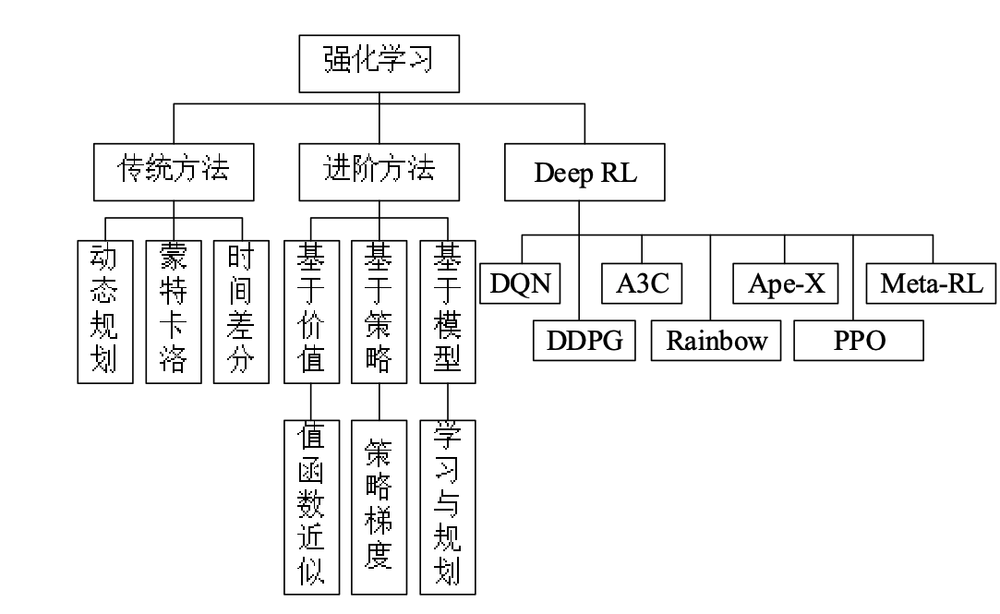

强化学习
========

学习路径：马尔科夫过程-\>贝尔曼方程-\>动态规划法-\>蒙特卡洛法-\>时间差分法-\>Sarsa算法-\>Q-learning算法-\>值函数近似法-\>策略梯度法-\>基于模型的强化学习-\>蒙特卡洛树搜索-\>DQN-\>DDPG-\>A3C-\>Rainbow-\>Ape-X-\>PPO-\>Meta-RL

网课
----

1.  强化学习论文解读-10 mins paper，上海交大伯禹讲论文\
    B站伯禹账号：<https://space.bilibili.com/447303411>\
    DQN： <https://www.bilibili.com/video/BV1H4411d7Mh>\
    DDPG： <https://www.bilibili.com/video/BV18E411f7zd>\
    TD3： <https://www.bilibili.com/video/BV1nE41117CR>\
    PPO： <https://www.bilibili.com/video/BV1pE41117zu>\
    Soft Actor-Critic： <https://www.bilibili.com/video/BV1pE41117q1>\
    QMIX： <https://www.bilibili.com/video/BV1pE411176N>\
    VDRL： <https://www.bilibili.com/video/BV1nE41117qu>\
    Nash Q-Learning： <https://www.bilibili.com/video/BV1mE411b7fW>\
    RL with Deep Energy-Based Policies：
    <https://www.bilibili.com/video/BV1pE41117C2>\
    Interactive Teaching Algorithm for IRL： [
    https://www.bilibili.com/video/BV1mE411b7eu](https://www.bilibili.com/video/BV1mE411b7eu)\
    Least-Squares Temporal Difference Learning：
    <https://www.bilibili.com/video/BV1nE41117C8>

2.  强化学习 Reinforcement Learning (莫烦 Python 教程)\
    链接：<https://www.bilibili.com/video/av16921335?from=search&seid=7037144790835305588>\
    代码：<https://github.com/AndyYue1893/Reinforcement-learning-with-tensorflow>

3.  DeepMind - David Silver - UCL深度强化学习课程(2015)\
    链接：<https://www.bilibili.com/video/av45357759?from=search&seid=7037144790835305588>\
    PPT地址：<https://blog.csdn.net/u_say2what/article/details/89216190>\
    笔记及代码：<https://zhuanlan.zhihu.com/p/37690204>

4.  台大李宏毅 深度强化学习(国语)课程(2018)\
    链接：<https://www.bilibili.com/video/av24724071?from=search&seid=7037144790835305588>\
    PPT地址：<https://www.bilibili.com/video/av24724071?from=search&seid=7037144790835305588>\
    学习笔记：<https://blog.csdn.net/cindy_1102/article/details/87904928>

5.  UC Berkeley - Sergey Levine - CS285(294)深度强化学习(2019)\
    链接：<https://www.bilibili.com/video/av69455099?from=search&seid=7037144790835305588>\
    PPT地址：<http://rail.eecs.berkeley.edu/deeprlcourse/>\
    代码：<https://github.com/berkeleydeeprlcourse/homework>

书籍
----

1.  强化学习（第2版）（Rich Sutton）\
    链接：<https://item.jd.com/12696004.html>\
    介绍：基础必读，有助于理解强化学习精髓\
    英文电子版：<http://incompleteideas.net/book/the-book-2nd.html>\
    代码：<https://github.com/AndyYue1893/reinforcement-learning-an-introduction>

2.  Python强化学习实战：应用OpenAI
    Gym和TensorFlow精通强化学习和深度强化学习（Sudharsan.Ravichandiran）\
    链接：<https://item.jd.com/12506442.html>\
    代码：<https://github.com/AndyYue1893/Hands-On-Reinforcement-Learning-With-Python>

3.  强化学习精要：核心算法与TensorFlow实现（冯超）\
    链接：<https://item.jd.com/12344157.html>\
    代码：<https://pan.baidu.com/share/init?surl=nQpNbhkI-3WucSD0Mk7Qcg>
    提取码: av5p

4.  深度强化学习原理与实践（陈仲铭）\
    链接：<https://item.jd.com/12524381.html>\
    代码：<https://github.com/chenzomi12/Deep-Reinforcement-Learning>

经典论文
--------

### 典型应用

1.  AlphaGo：<https://www.nature.com/articles/nature16961>，战胜人类棋手，David
    Silver等人发表于Nature

2.  玩Atari：<https://deepmind.com/research/publications/playing-atari-deep-reinforcement-learning>，游戏领域超过普通玩家

3.  玩Pong：<http://karpathy.github.io/2016/05/31/rl/>

4.  教小人走路：<https://arxiv.org/abs/1707.02286>，Deepmind出品，入门必玩项目

5.  控制机械臂：<https://ai.googleblog.com/2016/03/deep-learningfor-robots-learningfrom.html>

### 传统方法

1.  蒙特卡洛估计：\
    <https://link.springer.com/chapter/10.1007/11871842_29>

2.  时间差分学习：\
    [Off-Policy Temporal-Difference Learning with Function
    Approximation](https://www.researchgate.net/publication/2371944_Off-Policy_Temporal-Difference_Learning_with_Function_Approximation)

### 强化学习理论

1.  Policy Gradient Methods for Reinforcement Learning with Function
    Approximation\
    链接：<https://papers.nips.cc/paper/1713-policy-gradient-methods-for-reinforcement-learning-with-function-approximation.pdf>,
    Sutton et al, 2000.\
    主要贡献： 建立policy gradient理论，并展示出对任意policy
    classes，算法都可以收敛。

2.  An Analysis of Temporal-Difference Learning with Function
    Approximation\
    链接：<http://web.mit.edu/jnt/www/Papers/J063-97-bvr-td.pdf>,
    Tsitsiklis and Van Roy, 1997.\
    主要贡献： RL中价值学习方法的各种收敛结果和反例。

3.  Reinforcement Learning of Motor Skills with Policy Gradients\
    链接：<http://www.kyb.mpg.de/fileadmin/user_upload/files/publications/attachments/Neural-Netw-2008-21-682_48670.pdf>,
    Peters and Schaal, 2008.\
    主要贡献：彻底地回顾了当时policy
    gradient各种方法，其中有很多现在依然是非常有用的DRL方法。

4.  Approximately Optimal Approximate Reinforcement Learning\
    链接：[https://people.eecs.berkeley.edu/ pabbeel/cs287-fa09/readings/KakadeLangford-icml2002.pdf](https://people.eecs.berkeley.edu/~pabbeel/cs287-fa09/readings/KakadeLangford-icml2002.pdf),
    Kakade and Langford, 2002.\
    主要贡献：单调优化理论的早期来源，是后来TRPO和其他算法的理论依据。

5.  A Natural Policy Gradient\
    链接：<https://papers.nips.cc/paper/2073-a-natural-policy-gradient.pdf>,
    Kakade, 2002.\
    主要贡献：在RL中引入了natural gradients，后来在deep
    RL中引入了TRPO、ACKTR和其他一些方法。

6.  Algorithms for Reinforcement Learning\
    链接：[https://sites.ualberta.ca/ szepesva/papers/RLAlgsInMDPs.pdf](https://sites.ualberta.ca/~szepesva/papers/RLAlgsInMDPs.pdf),
    Szepesvari, 2009.\
    主要贡献：在DRL之前对RL的基础和理论背景进行了综合讲解

### Model-Free RL

#### a. Deep Q-Learning

1.  Playing Atari with Deep Reinforcement Learning:
    [https://www.cs.toronto.edu/ vmnih/docs/dqn.pdf](https://www.cs.toronto.edu/~vmnih/docs/dqn.pdf),
    Mnih et al, 2013. **Algorithm: DQN.**

2.  Deep Recurrent Q-Learning for Partially Observable MDPs:
    <https://arxiv.org/abs/1507.06527>, Hausknecht and Stone, 2015.
    **Algorithm: Deep Recurrent Q-Learning.**

3.  Dueling Network Architectures for Deep Reinforcement Learning:
    <https://arxiv.org/abs/1511.06581>, Wang et al, 2015. **Algorithm:
    Dueling DQN.**

4.  Deep Reinforcement Learning with Double Q-learning:
    <https://arxiv.org/abs/1509.06461>, Hasselt et al 2015. **Algorithm:
    Double DQN.**

5.  Prioritized Experience Replay:
    <https://arxiv.org/abs/1511.05952>, Schaul et al, 2015. **Algorithm:
    Prioritized Experience Replay (PER).**

6.  Rainbow: Combining Improvements in Deep Reinforcement Learning:
    <https://arxiv.org/abs/1710.02298>, Hessel et al, 2017. **Algorithm:
    Rainbow DQN.**

#### b. Policy Gradients

1.  Asynchronous Methods for Deep Reinforcement Learning:
    <https://arxiv.org/abs/1602.01783>, Mnih et al, 2016. **Algorithm:
    A3C.**

2.  Trust Region Policy Optimization:
    <https://arxiv.org/abs/1502.05477>, Schulman et al, 2015.
    **Algorithm: TRPO.**

3.  High-Dimensional Continuous Control Using Generalized Advantage
    Estimation:
    <https://arxiv.org/abs/1506.02438>, Schulman et al, 2015.
    **Algorithm: GAE.**

4.  Proximal Policy Optimization Algorithms:
    <https://arxiv.org/abs/1707.06347>, Schulman et al, 2017.
    **Algorithm: PPO-Clip, PPO-Penalty.**

5.  Emergence of Locomotion Behaviours in Rich Environments:
    <https://arxiv.org/abs/1707.02286>, Heess et al, 2017. **Algorithm:
    PPO-Penalty.**

6.  Scalable trust-region method for deep reinforcement learning using
    Kronecker-factored approximation:
    <https://arxiv.org/abs/1708.05144>, Wu et al, 2017. **Algorithm:
    ACKTR.**

7.  Sample Efficient Actor-Critic with Experience Replay:
    <https://arxiv.org/abs/1611.01224>, Wang et al, 2016. **Algorithm:
    ACER.**

8.  Soft Actor-Critic: Off-Policy Maximum Entropy Deep Reinforcement
    Learning with a Stochastic Actor:
    <https://arxiv.org/abs/1801.01290>, Haarnoja et al, 2018.
    **Algorithm: SAC.**

#### c. Deterministic Policy Gradients

1.  Deterministic Policy Gradient Algorithms:
    <http://proceedings.mlr.press/v32/silver14.pdf>, Silver et al, 2014.
    **Algorithm: DPG.**

2.  Continuous Control With Deep Reinforcement Learning:
    <https://arxiv.org/abs/1509.02971>, Lillicrap et al, 2015.
    **Algorithm: DDPG.**

3.  Addressing Function Approximation Error in Actor-Critic Methods:
    <https://arxiv.org/abs/1802.09477>, Fujimoto et al, 2018.
    **Algorithm: TD3.**

#### d. Distributional RL

1.  A Distributional Perspective on Reinforcement Learning:
    <https://arxiv.org/abs/1707.06887>, Bellemare et al, 2017.
    **Algorithm: C51.**

2.  Distributional Reinforcement Learning with Quantile Regression:
    <https://arxiv.org/abs/1710.10044>, Dabney et al, 2017. **Algorithm:
    QR-DQN.**

3.  Implicit Quantile Networks for Distributional Reinforcement
    Learning:
    <https://arxiv.org/abs/1806.06923>, Dabney et al, 2018. **Algorithm:
    IQN.**

4.  Dopamine: A Research Framework for Deep Reinforcement Learning:
    <https://openreview.net/forum?id=ByG_3s09KX>, Anonymous, 2018.
    **Contribution:** 介绍了Dopamine, 一个实现了DQN, C51, IQN,
    和Rainbow等算法的代码仓. [Code link.

#### e. Policy Gradients with Action-Dependent Baselines

1.  Q-Prop: Sample-Efficient Policy Gradient with An Off-Policy Critic:
    <https://arxiv.org/abs/1611.02247>, Gu et al, 2016. **Algorithm:
    Q-Prop.**

2.  Action-depedent Control Variates for Policy Optimization via Stein’s
    Identity:
    <https://arxiv.org/abs/1710.11198>, Liu et al, 2017. **Algorithm:
    Stein Control Variates.**

3.  The Mirage of Action-Dependent Baselines in Reinforcement Learning:
    <https://arxiv.org/abs/1802.10031>, Tucker et al, 2018.
    **Contribution:**
    这篇论文中，对以前的论文中的说法（包括Q-Prop和Stein Control
    Variates）进行了批判和重新评价，并发现其中存在重要的方法论错误。

#### f. Path-Consistency Learning

1.  Bridging the Gap Between Value and Policy Based Reinforcement
    Learning:
    <https://arxiv.org/abs/1702.08892>, Nachum et al, 2017. **Algorithm:
    PCL.**

2.  Trust-PCL: An Off-Policy Trust Region Method for Continuous
    Control:
    <https://arxiv.org/abs/1707.01891>, Nachum et al, 2017. **Algorithm:
    Trust-PCL.**

#### g. Other Directions for Combining Policy-Learning and Q-Learning

1.  Combining Policy Gradient and Q-learning:
    <https://arxiv.org/abs/1611.01626>, O’Donoghue et al, 2016.
    **Algorithm: PGQL.**

2.  The Reactor: A Fast and Sample-Efficient Actor-Critic Agent for
    Reinforcement Learning:
    <https://arxiv.org/abs/1704.04651>, Gruslys et al, 2017.
    **Algorithm: Reactor.**

3.  Interpolated Policy Gradient: Merging On-Policy and Off-Policy
    Gradient Estimation for Deep Reinforcement Learning:
    <http://papers.nips.cc/paper/6974-interpolated-policy-gradient-merging-on-policy-and-off-policy-gradient-estimation-for-deep-reinforcement-learning>,
    Gu et al, 2017. **Algorithm: IPG.**

4.  Equivalence Between Policy Gradients and Soft Q-Learning:
    <https://arxiv.org/abs/1704.06440>, Schulman et al, 2017.
    **Contribution:** 揭示了这两类RL算法之间的理论联系。

#### h. Evolutionary Algorithms

1.  Evolution Strategies as a Scalable Alternative to Reinforcement
    Learning:
    <https://arxiv.org/abs/1703.03864>, Salimans et al, 2017.
    **Algorithm: ES.**

### Model-Based RL

#### a. Model is Learned

1.  Imagination-Augmented Agents for Deep Reinforcement Learning:
    <https://arxiv.org/abs/1707.06203>, Weber et al, 2017. **Algorithm:
    I2A.**

2.  Neural Network Dynamics for Model-Based Deep Reinforcement Learning
    with Model-Free Fine-Tuning:
    <https://arxiv.org/abs/1708.02596>, Nagabandi et al, 2017.
    **Algorithm: MBMF.**

3.  Model-Based Value Expansion for Efficient Model-Free Reinforcement
    Learning:
    <https://arxiv.org/abs/1803.00101>, Feinberg et al, 2018.
    **Algorithm: MVE.**

4.  Sample-Efficient Reinforcement Learning with Stochastic Ensemble
    Value Expansion:
    <https://arxiv.org/abs/1807.01675>, Buckman et al, 2018.
    **Algorithm: STEVE.**

5.  Model-Ensemble Trust-Region Policy Optimization:
    <https://openreview.net/forum?id=SJJinbWRZ&noteId=SJJinbWRZ>,
    Kurutach et al, 2018. **Algorithm: ME-TRPO.**

6.  Model-Based Reinforcement Learning via Meta-Policy Optimization:
    <https://arxiv.org/abs/1809.05214>, Clavera et al, 2018.
    **Algorithm: MB-MPO.**

7.  Recurrent World Models Facilitate Policy Evolution:
    <https://arxiv.org/abs/1809.01999>, Ha and Schmidhuber, 2018.

#### b. Model is Given

1.  Mastering Chess and Shogi by Self-Play with a General Reinforcement
    Learning Algorithm:
    <https://arxiv.org/abs/1712.01815>, Silver et al, 2017. **Algorithm:
    AlphaZero.**

2.  Thinking Fast and Slow with Deep Learning and Tree Search:
    <https://arxiv.org/abs/1705.08439>, Anthony et al, 2017.
    **Algorithm: ExIt.**

### Imitation Learning & Inverse Reinforcement Learning

1.  Guided Cost Learning: Deep Inverse Optimal Control via Policy
    Optimization:
    <https://arxiv.org/abs/1603.00448>, Finn et al, 2016. **Algorithm:
    GCL.**

2.  Maximum Entropy Deep Inverse Reinforcement Learning:
    <http://arxiv.org/abs/1507.04888>, M. Wulfmeier et al., *arXiv*,
    2015.

3.  Modeling Purposeful Adaptive Behavior with the Principle of Maximum
    Causal Entropy:
    [http://www.cs.cmu.edu/ bziebart/publications/thesis-bziebart.pdf](http://www.cs.cmu.edu/~bziebart/publications/thesis-bziebart.pdf),
    Ziebart 2010. **Contributions:** 最大熵IRL的公式提出和推导.

4.  Generative Adversarial Imitation Learning:
    <https://arxiv.org/abs/1606.03476>, Ho and Ermon, 2016. **Algorithm:
    GAIL.**

5.  DeepMimic: Example-Guided Deep Reinforcement Learning of
    Physics-Based Character Skills:
    <https://xbpeng.github.io/projects/DeepMimic/2018_TOG_DeepMimic.pdf>,
    Peng et al, 2018. **Algorithm: DeepMimic.**

6.  Variational Discriminator Bottleneck: Improving Imitation Learning,
    Inverse RL, and GANs by Constraining Information Flow:
    <https://arxiv.org/abs/1810.00821>, Peng et al, 2018. **Algorithm:
    VAIL.**

7.  One-Shot High-Fidelity Imitation: Training Large-Scale Deep Nets
    with RL:
    <https://arxiv.org/abs/1810.05017>, Le Paine et al, 2018.
    **Algorithm: MetaMimic.**

### Multi-Task and Transfer Learning

1.  Actor-Mimic: Deep Multitask and Transfer Reinforcement Learning:
    <http://arxiv.org/abs/1511.06342>, E. Parisotto, et al., *ICLR*,
    2016.

2.  Policy Distillation:
    <http://arxiv.org/abs/1511.06295>, A. A. Rusu et at., *ICLR*,
    2016.

3.  ADAAPT: A Deep Architecture for Adaptive Policy Transfer from
    Multiple Sources:
    <http://arxiv.org/abs/1510.02879>, J. Rajendran et al., *arXiv*,
    2015.

4.  Universal Value Function Approximators:
    <http://schaul.site44.com/publications/uvfa.pdf>, T. Schaul et al.,
    *ICML*, 2015.**Algorithm: UVFA.**

5.  Progressive Neural Networks:
    <https://arxiv.org/abs/1606.04671>, Rusu et al, 2016. **Algorithm:
    Progressive Networks.**

6.  Reinforcement Learning with Unsupervised Auxiliary Tasks:
    <https://arxiv.org/abs/1611.05397>, Jaderberg et al, 2016.
    **Algorithm: UNREAL.**

7.  The Intentional Unintentional Agent: Learning to Solve Many
    Continuous Control Tasks Simultaneously:
    <https://arxiv.org/abs/1707.03300>, Cabi et al, 2017. **Algorithm:
    IU Agent.**

8.  PathNet: Evolution Channels Gradient Descent in Super Neural
    Networks:
    <https://arxiv.org/abs/1701.08734>, Fernando et al, 2017.
    **Algorithm: PathNet.**

9.  Mutual Alignment Transfer Learning:
    <https://arxiv.org/abs/1707.07907>, Wulfmeier et al, 2017.
    **Algorithm: MATL.**

10. Learning an Embedding Space for Transferable Robot Skills:
    <https://openreview.net/forum?id=rk07ZXZRb&noteId=rk07ZXZRb>,
    Hausman et al, 2018.

11. Hindsight Experience Replay:
    <https://arxiv.org/abs/1707.01495>, Andrychowicz et al, 2017.
    **Algorithm: Hindsight Experience Replay (HER).**

### Meta-RL

1.  RL2: Fast Reinforcement Learning via Slow Reinforcement Learning:
    <https://arxiv.org/abs/1611.02779>, Duan et al, 2016. **Algorithm:
    RL2.**

2.  Learning to Reinforcement Learn:
    <https://arxiv.org/abs/1611.05763>, Wang et al, 2016.

3.  Model-Agnostic Meta-Learning for Fast Adaptation of Deep Networks:
    <https://arxiv.org/abs/1703.03400>, Finn et al, 2017. **Algorithm:
    MAML.**

4.  A Simple Neural Attentive Meta-Learner:
    <https://openreview.net/forum?id=B1DmUzWAW&noteId=B1DmUzWAW>, Mishra
    et al, 2018. **Algorithm: SNAIL.**

### Improving Exploration

#### a. Intrinsic Motivation

1.  VIME: Variational Information Maximizing Exploration:
    <https://arxiv.org/abs/1605.09674>, Houthooft et al, 2016.
    **Algorithm: VIME.**

2.  Unifying Count-Based Exploration and Intrinsic Motivation:
    <https://arxiv.org/abs/1606.01868>, Bellemare et al, 2016.
    **Algorithm: CTS-based Pseudocounts.**

3.  Count-Based Exploration with Neural Density Models:
    <https://arxiv.org/abs/1703.01310>, Ostrovski et al, 2017.
    **Algorithm: PixelCNN-based Pseudocounts.**

4.  \#Exploration: A Study of Count-Based Exploration for Deep
    Reinforcement Learning:
    <https://arxiv.org/abs/1611.04717>, Tang et al, 2016. **Algorithm:
    Hash-based Counts.**

5.  EX2: Exploration with Exemplar Models for Deep Reinforcement
    Learning:
    <https://arxiv.org/abs/1703.01260>, Fu et al, 2017. **Algorithm:
    EX2.**

6.  Curiosity-driven Exploration by Self-supervised Prediction:
    <https://arxiv.org/abs/1705.05363>, Pathak et al, 2017. **Algorithm:
    Intrinsic Curiosity Module (ICM).**

7.  Large-Scale Study of Curiosity-Driven Learning:
    <https://arxiv.org/abs/1808.04355>, Burda et al, 2018.
    **Contribution:** 系统分析基于好奇心的内在动机算法在各种环境中的表现

8.  Exploration by Random Network Distillation:
    <https://arxiv.org/abs/1810.12894>, Burda et al, 2018. **Algorithm:
    RND.**

#### b. Unsupervised RL

1.  Variational Intrinsic Control:
    <https://arxiv.org/abs/1611.07507>, Gregor et al, 2016. **Algorithm:
    VIC.**

2.  Diversity is All You Need: Learning Skills without a Reward
    Function:
    <https://arxiv.org/abs/1802.06070>, Eysenbach et al, 2018.
    **Algorithm: DIAYN.**

3.  Variational Option Discovery Algorithms:
    <https://arxiv.org/abs/1807.10299>, Achiam et al, 2018. **Algorithm:
    VALOR.**

### Multi-Agent

1.  Learning to Communicate to Solve Riddles with Deep Distributed
    Recurrent Q-Networks:
    <http://arxiv.org/abs/1602.02672>, J. N. Foerster et al., *arXiv*,
    2016.

2.  Multiagent Cooperation and Competition with Deep Reinforcement
    Learning:
    <http://arxiv.org/abs/1511.08779>, A. Tampuu et al., *arXiv*,
    2015.

### Hierarchical Learning

1.  Deep Successor Reinforcement Learning:
    <http://arxiv.org/abs/1606.02396>, T. D. Kulkarni et al., *arXiv*,
    2016.

2.  Hierarchical Reinforcement Learning using Spatio-Temporal
    Abstractions and Deep Neural Networks:
    <https://arxiv.org/abs/1605.05359>, R. Krishnamurthy et al.,
    *arXiv*, 2016.

3.  Hierarchical Deep Reinforcement Learning: Integrating Temporal
    Abstraction and Intrinsic Motivation:
    <https://arxiv.org/abs/1604.06057>, T. D. Kulkarni et al.,
    *arXiv*, 2016.

4.  Strategic Attentive Writer for Learning Macro-Actions:
    <https://arxiv.org/abs/1606.04695>, Vezhnevets et al, 2016.
    **Algorithm: STRAW.**

5.  FeUdal Networks for Hierarchical Reinforcement Learning:
    <https://arxiv.org/abs/1703.01161>, Vezhnevets et al, 2017.
    **Algorithm: Feudal Networks**

6.  Data-Efficient Hierarchical Reinforcement Learning:
    <https://arxiv.org/abs/1805.08296>, Nachum et al, 2018. **Algorithm:
    HIRO.**

### Safety

1.  Concrete Problems in AI Safety:
    <https://arxiv.org/abs/1606.06565>, Amodei et al, 2016.
    **Contribution:** 建立安全问题的分类，这个方向需要解决的问题。

2.  Deep Reinforcement Learning From Human Preferences:
    <https://arxiv.org/abs/1706.03741>, Christiano et al, 2017.
    **Algorithm: LFP.**

3.  Constrained Policy Optimization:
    <https://arxiv.org/abs/1705.10528>, Achiam et al, 2017. **Algorithm:
    CPO.**

4.  Safe Exploration in Continuous Action Spaces:
    <https://arxiv.org/abs/1801.08757>, Dalal et al, 2018. **Algorithm:
    DDPG+Safety Layer.**

5.  Trial without Error: Towards Safe Reinforcement Learning via Human
    Intervention:
    <https://arxiv.org/abs/1707.05173>, Saunders et al, 2017.
    **Algorithm: HIRL.**

6.  Leave No Trace: Learning to Reset for Safe and Autonomous
    Reinforcement Learning:
    <https://arxiv.org/abs/1711.06782>, Eysenbach et al, 2017.
    **Algorithm: Leave No Trace.**

### Memory

1.  Model-Free Episodic Control:
    <https://arxiv.org/abs/1606.04460>, Blundell et al, 2016.
    **Algorithm: MFEC.**

2.  Neural Episodic Control:
    <https://arxiv.org/abs/1703.01988>, Pritzel et al, 2017.
    **Algorithm: NEC.**

3.  Neural Map: Structured Memory for Deep Reinforcement Learning:
    <https://arxiv.org/abs/1702.08360>, Parisotto and Salakhutdinov,
    2017. **Algorithm: Neural Map.**

4.  Unsupervised Predictive Memory in a Goal-Directed Agent:
    <https://arxiv.org/abs/1803.10760>,
    Wayne et al, 2018. **Algorithm: MERLIN.**

5.  Relational Recurrent Neural Networks:
    <https://arxiv.org/abs/1806.01822>, Santoro et al, 2018.
    **Algorithm: RMC.**

### Scaling RL（分布式RL）

1.  Accelerated Methods for Deep Reinforcement Learning:
    <https://arxiv.org/abs/1803.02811>, Stooke and Abbeel, 2018.
    **Contribution:** 跨算法的深度RL中的并行化系统分析。

2.  IMPALA: Scalable Distributed Deep-RL with Importance Weighted
    Actor-Learner Architectures:
    <https://arxiv.org/abs/1802.01561>, Espeholt et al, 2018.
    **Algorithm: IMPALA.**

3.  Distributed Prioritized Experience Replay:
    [https://openreview.net/forum?id=H1Dy—0Z](https://openreview.net/forum?id=H1Dy---0Z),
    Horgan et al, 2018. **Algorithm: Ape-X.**

4.  Recurrent Experience Replay in Distributed Reinforcement Learning:
    <https://openreview.net/forum?id=r1lyTjAqYX>, Anonymous, 2018.
    **Algorithm: R2D2.**

5.  RLlib: Abstractions for Distributed Reinforcement Learning:
    <https://arxiv.org/abs/1712.09381>, Liang et al, 2017.
    **Contribution:** 提出一个实现了17年前大部分RL算法的可扩展库。

### RL in the Real World

1.  Benchmarking Reinforcement Learning Algorithms on Real-World
    Robots:
    <https://arxiv.org/abs/1809.07731>, Mahmood et al, 2018.

2.  Learning Dexterous In-Hand Manipulation:
    <https://arxiv.org/abs/1808.00177>, OpenAI, 2018.

3.  QT-Opt: Scalable Deep Reinforcement Learning for Vision-Based
    Robotic Manipulation:
    <https://arxiv.org/abs/1806.10293>, Kalashnikov et al, 2018.
    **Algorithm: QT-Opt.**

4.  Horizon: Facebook’s Open Source Applied Reinforcement Learning
    Platform:
    <https://arxiv.org/abs/1811.00260>, Gauci et al, 2018.

### RL的可复现性等方面的分析

1.  Benchmarking Deep Reinforcement Learning for Continuous Control:
    <https://arxiv.org/abs/1604.06778>, Duan et al, 2016.
    **Contribution: rllab库.**

2.  Reproducibility of Benchmarked Deep Reinforcement Learning Tasks for
    Continuous Control:
    <https://arxiv.org/abs/1708.04133>, Islam et al, 2017.

3.  Deep Reinforcement Learning that Matters:
    <https://arxiv.org/abs/1709.06560>, Henderson et al, 2017.

4.  Where Did My Optimum Go?: An Empirical Analysis of Gradient Descent
    Optimization in Policy Gradient Methods:
    <https://arxiv.org/abs/1810.02525>, Henderson et al, 2018.

5.  Are Deep Policy Gradient Algorithms Truly Policy Gradient
    Algorithms?:
    <https://arxiv.org/abs/1811.02553>, Ilyas et al, 2018.

6.  Simple Random Search Provides a Competitive Approach to
    Reinforcement Learning:
    <https://arxiv.org/abs/1803.07055>, Mania et al, 2018.

7.  Benchmarking Model-Based Reinforcement Learning:
    <https://arxiv.org/abs/1907.02057>, Wang et al, 2019.

## More Papers

### Bookmarks

  * [Text Domain](##text-domain)
  * [Visual Domain](##visual-domain)
  * [Robotics](##robotics)
  * [Games](##games)

### Text Domain

  * [Strategic Dialogue Management via Deep Reinforcement Learning](http://arxiv.org/abs/1511.08099), H. Cuayáhuitl et al., *NIPS Workshop*, 2015.
  * [MazeBase: A Sandbox for Learning from Games](http://arxiv.org/abs/1511.07401), S. Sukhbaatar et al., *arXiv*, 2016.
  * [Deep Reinforcement Learning with an Action Space Defined by Natural Language](http://arxiv.org/abs/1511.04636), J. He et al., *arXiv*, 2015.
  * [Generating Text with Deep Reinforcement Learning](http://arxiv.org/abs/1510.09202), H. Guo, *arXiv*, 2015.
  * [Language Understanding for Text-based Games Using Deep Reinforcement Learning](http://people.csail.mit.edu/karthikn/pdfs/mud-play15.pdf), K. Narasimhan et al., *EMNLP*, 2015.
  * [Listen, Attend, and Walk: Neural Mapping of Navigational Instructions to Action Sequences](http://arxiv.org/abs/1506.04089), H. Mei et al., *arXiv*, 2015.

### Visual Domain

  * [Model-Free Episodic Control](http://arxiv.org/abs/1606.04460), C. Blundell et al., *arXiv*, 2016.
  * [Deep Successor Reinforcement Learning](http://arxiv.org/abs/1606.02396), T. D. Kulkarni et al., *arXiv*, 2016.
  * [Unifying Count-Based Exploration and Intrinsic Motivation](https://arxiv.org/abs/1606.01868), M. G. Bellemare et al., *arXiv*, 2016.
  * [Control of Memory, Active Perception, and Action in Minecraft](http://arxiv.org/abs/1605.09128), J. Oh et al., *ICML*, 2016.
  * [Dynamic Frame skip Deep Q Network](http://arxiv.org/abs/1605.05365), A. S. Lakshminarayanan et al., *IJCAI Deep RL Workshop*, 2016.
  * [Hierarchical Reinforcement Learning using Spatio-Temporal Abstractions and Deep Neural Networks](https://arxiv.org/abs/1605.05359), R. Krishnamurthy et al., *arXiv*, 2016.
  * [Hierarchical Deep Reinforcement Learning: Integrating Temporal Abstraction and Intrinsic Motivation](https://arxiv.org/abs/1604.06057), T. D. Kulkarni et al., *arXiv*, 2016.
  * [Learning Hand-Eye Coordination for Robotic Grasping with Deep Learning and Large-Scale Data Collection](http://arxiv.org/abs/1603.02199), S. Levine et al., *arXiv*, 2016.
  * [Deep Exploration via Bootstrapped DQN](http://arxiv.org/abs/1602.04621), I. Osband et al., *arXiv*, 2016.
  * [Value Iteration Networks](http://arxiv.org/abs/1602.02867), A. Tamar et al., *arXiv*, 2016.
  * [Asynchronous Methods for Deep Reinforcement Learning](http://arxiv.org/abs/1602.01783), V. Mnih et al., *arXiv*, 2016.
  * [Mastering the game of Go with deep neural networks and tree search](http://www.nature.com/nature/journal/v529/n7587/full/nature16961.html), D. Silver et al., *Nature*, 2016.
  * [Increasing the Action Gap: New Operators for Reinforcement Learning](http://arxiv.org/abs/1512.04860), M. G. Bellemare et al., *AAAI*, 2016.
  * [Memory-based control with recurrent neural networks](http://arxiv.org/abs/1512.04455), N. Heess et al., *NIPS Workshop*, 2015.
  * [How to Discount Deep Reinforcement Learning: Towards New Dynamic Strategies](http://arxiv.org/abs/1512.02011), V. François-Lavet et al., *NIPS Workshop*, 2015.
  * [Multiagent Cooperation and Competition with Deep Reinforcement Learning](http://arxiv.org/abs/1511.08779), A. Tampuu et al., *arXiv*, 2015.
  * [Dueling Network Architectures for Deep Reinforcement Learning](http://arxiv.org/abs/1511.06581), Z. Wang et al., *arXiv*, 2015.
  * [Actor-Mimic: Deep Multitask and Transfer Reinforcement Learning](http://arxiv.org/abs/1511.06342), E. Parisotto, et al., *ICLR*, 2016.
  * [Better Computer Go Player with Neural Network and Long-term Prediction](http://arxiv.org/abs/1511.06410), Y. Tian et al., *ICLR*, 2016.
  * [Policy Distillation](http://arxiv.org/abs/1511.06295), A. A. Rusu et at., *ICLR*, 2016.
  * [Prioritized Experience Replay](http://arxiv.org/abs/1511.05952), T. Schaul et al., *ICLR*, 2016.
  * [Deep Reinforcement Learning in Parameterized Action Space](http://arxiv.org/abs/1511.04143), M. Hausknecht et al., *ICLR*, 2016.
  * [Towards Vision-Based Deep Reinforcement Learning for Robotic Motion Control](http://arxiv.org/abs/1511.03791), F. Zhang et al., *arXiv*, 2015.
  * [Variational Information Maximisation for Intrinsically Motivated Reinforcement Learning](http://arxiv.org/abs/1509.08731), S. Mohamed and D. J. Rezende, *arXiv*, 2015.
  * [Deep Reinforcement Learning with Double Q-learning](http://arxiv.org/abs/1509.06461), H. van Hasselt et al., *arXiv*, 2015.
  * [Continuous control with deep reinforcement learning](http://arxiv.org/abs/1509.02971), T. P. Lillicrap et al., *ICLR*, 2016.
  * [Giraffe: Using Deep Reinforcement Learning to Play Chess](http://arxiv.org/abs/1509.01549), M. Lai, *arXiv*, 2015.
  * [Action-Conditional Video Prediction using Deep Networks in Atari Games](http://arxiv.org/abs/1507.08750), J. Oh et al., *NIPS*, 2015.
  * [Learning Continuous Control Policies by Stochastic Value Gradients](http://papers.nips.cc/paper/5796-learning-continuous-control-policies-by-stochastic-value-gradients.pdf), N. Heess et al., *NIPS*, 2015.
  * [Deep Recurrent Q-Learning for Partially Observable MDPs](http://arxiv.org/abs/1507.06527), M. Hausknecht and P. Stone, *arXiv*, 2015.
  * [Incentivizing Exploration In Reinforcement Learning With Deep Predictive Models](http://arxiv.org/abs/1507.00814), B. C. Stadie et al., *arXiv*, 2015.
  * [High-Dimensional Continuous Control Using Generalized Advantage Estimation](http://arxiv.org/abs/1506.02438), J. Schulman et al., *ICLR*, 2016.
  * [End-to-End Training of Deep Visuomotor Policies](http://arxiv.org/abs/1504.00702), S. Levine et al., *arXiv*, 2015.
  * [Universal Value Function Approximators](http://schaul.site44.com/publications/uvfa.pdf), T. Schaul et al., *ICML*, 2015.
  * [Massively Parallel Methods for Deep Reinforcement Learning](http://www0.cs.ucl.ac.uk/staff/d.silver/web/Publications_files/gorila.pdf), A. Nair et al., *ICML Workshop*, 2015.
  * [Trust Region Policy Optimization](http://jmlr.org/proceedings/papers/v37/schulman15.pdf), J. Schulman et al., *ICML*, 2015.
  * [Human-level control through deep reinforcement learning](http://www.nature.com/nature/journal/v518/n7540/pdf/nature14236.pdf), V. Mnih et al., *Nature*, 2015.
  * [Deep Learning for Real-Time Atari Game Play Using Offline Monte-Carlo Tree Search Planning](http://papers.nips.cc/paper/5421-deep-learning-for-real-time-atari-game-play-using-offline-monte-carlo-tree-search-planning.pdf), X. Guo et al., *NIPS*, 2014.
  * [Playing Atari with Deep Reinforcement Learning](https://www.cs.toronto.edu/~vmnih/docs/dqn.pdf), V. Mnih et al., *NIPS Workshop*, 2013.

### Robotics

  * [Curiosity-driven Exploration in Deep Reinforcement Learning via Bayesian Neural Networks](http://arxiv.org/abs/1605.09674), R. Houthooft et al., *arXiv*, 2016.
  * [Benchmarking Deep Reinforcement Learning for Continuous Control](https://arxiv.org/abs/1604.06778), Y. Duan et al., *ICML*, 2016.
  * [Learning Hand-Eye Coordination for Robotic Grasping with Deep Learning and Large-Scale Data Collection](http://arxiv.org/abs/1603.02199), S. Levine et al., *arXiv*, 2016.
  * [Continuous Deep Q-Learning with Model-based Acceleration](http://arxiv.org/abs/1603.00748), S. Gu et al., *ICML*, 2016.
  * [Guided Cost Learning: Deep Inverse Optimal Control via Policy Optimization](http://arxiv.org/abs/1603.00448), C. Finn et al., *arXiv*, 2016.
  * [Asynchronous Methods for Deep Reinforcement Learning](http://arxiv.org/abs/1602.01783), V. Mnih et al., *arXiv*, 2016.
  * [Memory-based control with recurrent neural networks](http://arxiv.org/abs/1512.04455), N. Heess et al., *NIPS Workshop*, 2015.
  * [Towards Vision-Based Deep Reinforcement Learning for Robotic Motion Control](http://arxiv.org/abs/1511.03791), F. Zhang et al., *arXiv*, 2015.
  * [Learning Continuous Control Policies by Stochastic Value Gradients](http://papers.nips.cc/paper/5796-learning-continuous-control-policies-by-stochastic-value-gradients.pdf), N. Heess et al., *NIPS*, 2015.
  * [Learning Deep Neural Network Policies with Continuous Memory States](http://arxiv.org/abs/1507.01273), M. Zhang et al., *arXiv*, 2015.
  * [High-Dimensional Continuous Control Using Generalized Advantage Estimation](http://arxiv.org/abs/1506.02438), J. Schulman et al., *ICLR*, 2016.
  * [End-to-End Training of Deep Visuomotor Policies](http://arxiv.org/abs/1504.00702), S. Levine et al., *arXiv*, 2015.
  * [DeepMPC: Learning Deep Latent Features for
    Model Predictive Control](http://deepmpc.cs.cornell.edu/DeepMPC.pdf), I. Lenz, et al., *RSS*, 2015.
  * [Trust Region Policy Optimization](http://jmlr.org/proceedings/papers/v37/schulman15.pdf), J. Schulman et al., *ICML*, 2015.

### Games

  * [Model-Free Episodic Control](http://arxiv.org/abs/1606.04460), C. Blundell et al., *arXiv*, 2016.
  * [Safe and Efficient Off-Policy Reinforcement Learning](https://arxiv.org/abs/1606.02647), R. Munos et al., *arXiv*, 2016.
  * [Deep Successor Reinforcement Learning](http://arxiv.org/abs/1606.02396), T. D. Kulkarni et al., *arXiv*, 2016.
  * [Unifying Count-Based Exploration and Intrinsic Motivation](https://arxiv.org/abs/1606.01868), M. G. Bellemare et al., *arXiv*, 2016.
  * [Control of Memory, Active Perception, and Action in Minecraft](http://arxiv.org/abs/1605.09128), J. Oh et al., *ICML*, 2016.
  * [Dynamic Frame skip Deep Q Network](http://arxiv.org/abs/1605.05365), A. S. Lakshminarayanan et al., *IJCAI Deep RL Workshop*, 2016.
  * [Hierarchical Reinforcement Learning using Spatio-Temporal Abstractions and Deep Neural Networks](https://arxiv.org/abs/1605.05359), R. Krishnamurthy et al., *arXiv*, 2016.
  * [Hierarchical Deep Reinforcement Learning: Integrating Temporal Abstraction and Intrinsic Motivation](https://arxiv.org/abs/1604.06057), T. D. Kulkarni et al., *arXiv*, 2016.
  * [Deep Exploration via Bootstrapped DQN](http://arxiv.org/abs/1602.04621), I. Osband et al., *arXiv*, 2016.
  * [Learning to Communicate to Solve Riddles with Deep Distributed Recurrent Q-Networks](http://arxiv.org/abs/1602.02672), J. N. Foerster et al., *arXiv*, 2016.
  * [Asynchronous Methods for Deep Reinforcement Learning](http://arxiv.org/abs/1602.01783), V. Mnih et al., *arXiv*, 2016.
  * [Mastering the game of Go with deep neural networks and tree search](http://www.nature.com/nature/journal/v529/n7587/full/nature16961.html), D. Silver et al., *Nature*, 2016.
  * [Increasing the Action Gap: New Operators for Reinforcement Learning](http://arxiv.org/abs/1512.04860), M. G. Bellemare et al., *AAAI*, 2016.
  * [How to Discount Deep Reinforcement Learning: Towards New Dynamic Strategies](http://arxiv.org/abs/1512.02011), V. François-Lavet et al., *NIPS Workshop*, 2015.
  * [Multiagent Cooperation and Competition with Deep Reinforcement Learning](http://arxiv.org/abs/1511.08779), A. Tampuu et al., *arXiv*, 2015.
  * [MazeBase: A Sandbox for Learning from Games](http://arxiv.org/abs/1511.07401), S. Sukhbaatar et al., *arXiv*, 2016.
  * [Dueling Network Architectures for Deep Reinforcement Learning](http://arxiv.org/abs/1511.06581), Z. Wang et al., *arXiv*, 2015.
  * [Better Computer Go Player with Neural Network and Long-term Prediction](http://arxiv.org/abs/1511.06410), Y. Tian et al., *ICLR*, 2016.
  * [Actor-Mimic: Deep Multitask and Transfer Reinforcement Learning](http://arxiv.org/abs/1511.06342), E. Parisotto, et al., *ICLR*, 2016.
  * [Policy Distillation](http://arxiv.org/abs/1511.06295), A. A. Rusu et at., *ICLR*, 2016.
  * [Prioritized Experience Replay](http://arxiv.org/abs/1511.05952), T. Schaul et al., *ICLR*, 2016.
  * [Deep Reinforcement Learning with an Action Space Defined by Natural Language](http://arxiv.org/abs/1511.04636), J. He et al., *arXiv*, 2015.
  * [Deep Reinforcement Learning in Parameterized Action Space](http://arxiv.org/abs/1511.04143), M. Hausknecht et al., *ICLR*, 2016.
  * [Variational Information Maximisation for Intrinsically Motivated Reinforcement Learning](http://arxiv.org/abs/1509.08731), S. Mohamed and D. J. Rezende, *arXiv*, 2015.
  * [Deep Reinforcement Learning with Double Q-learning](http://arxiv.org/abs/1509.06461), H. van Hasselt et al., *arXiv*, 2015.
  * [Continuous control with deep reinforcement learning](http://arxiv.org/abs/1509.02971), T. P. Lillicrap et al., *ICLR*, 2016.
  * [Language Understanding for Text-based Games Using Deep Reinforcement Learning](http://people.csail.mit.edu/karthikn/pdfs/mud-play15.pdf), K. Narasimhan et al., *EMNLP*, 2015.
  * [Giraffe: Using Deep Reinforcement Learning to Play Chess](http://arxiv.org/abs/1509.01549), M. Lai, *arXiv*, 2015.
  * [Action-Conditional Video Prediction using Deep Networks in Atari Games](http://arxiv.org/abs/1507.08750), J. Oh et al., *NIPS*, 2015.
  * [Deep Recurrent Q-Learning for Partially Observable MDPs](http://arxiv.org/abs/1507.06527), M. Hausknecht and P. Stone, *arXiv*, 2015.
  * [Incentivizing Exploration In Reinforcement Learning With Deep Predictive Models](http://arxiv.org/abs/1507.00814), B. C. Stadie et al., *arXiv*, 2015.
  * [Universal Value Function Approximators](http://schaul.site44.com/publications/uvfa.pdf), T. Schaul et al., *ICML*, 2015.
  * [Massively Parallel Methods for Deep Reinforcement Learning](http://www0.cs.ucl.ac.uk/staff/d.silver/web/Publications_files/gorila.pdf), A. Nair et al., *ICML Workshop*, 2015.
  * [Trust Region Policy Optimization](http://jmlr.org/proceedings/papers/v37/schulman15.pdf), J. Schulman et al., *ICML*, 2015.
  * [Human-level control through deep reinforcement learning](http://www.nature.com/nature/journal/v518/n7540/pdf/nature14236.pdf), V. Mnih et al., *Nature*, 2015.
  * [Deep Learning for Real-Time Atari Game Play Using Offline Monte-Carlo Tree Search Planning](http://papers.nips.cc/paper/5421-deep-learning-for-real-time-atari-game-play-using-offline-monte-carlo-tree-search-planning.pdf), X. Guo et al., *NIPS*, 2014.
  * [Playing Atari with Deep Reinforcement Learning](https://www.cs.toronto.edu/~vmnih/docs/dqn.pdf), V. Mnih et al., *NIPS Workshop*, 2013.

