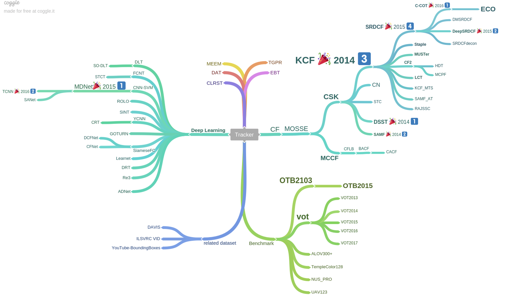
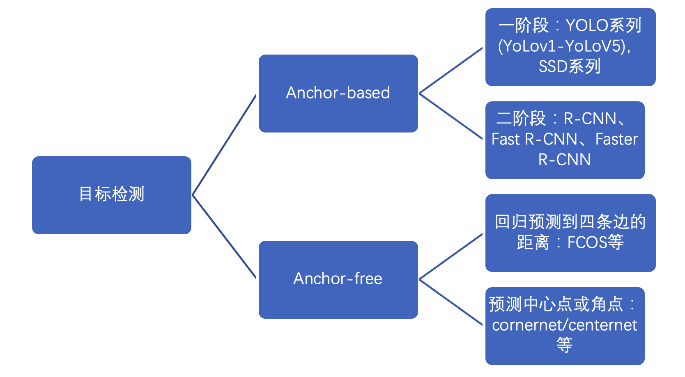
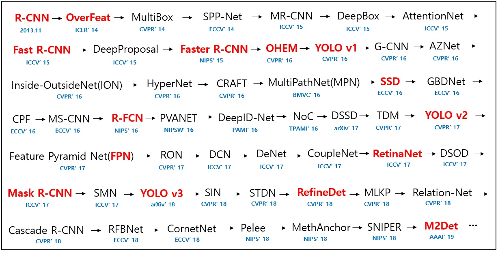
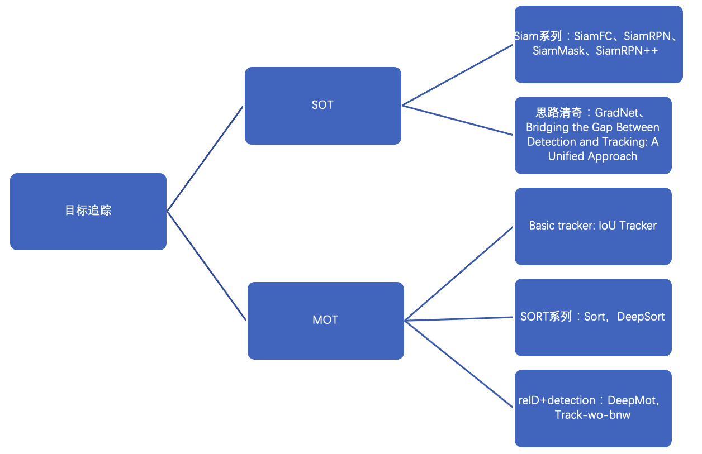
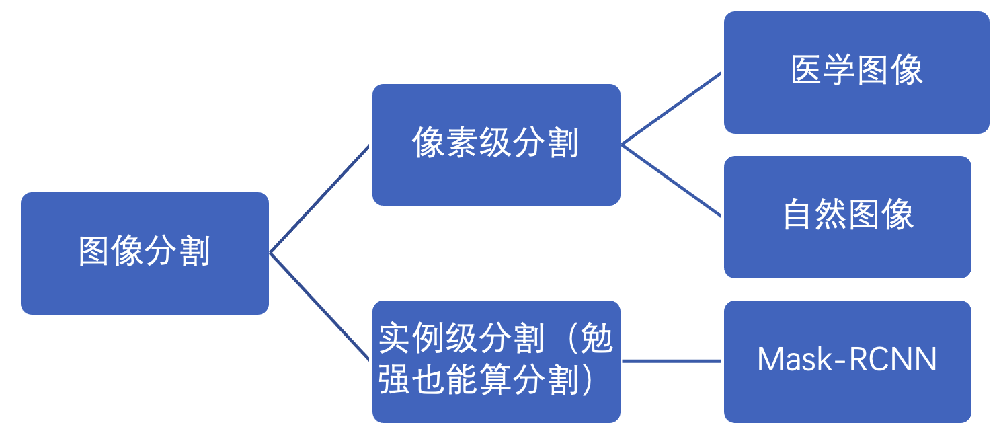
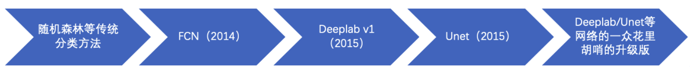

计算机视觉
==========
  * [传统算法的识别和跟踪](##传统算法的识别和跟踪)
  * [目标检测](##目标检测)
  * [目标追踪](##目标追踪)
  * [图像分割](##图像分割)
  
传统算法的识别和跟踪
--------------------

<figure>
  
  <figcaption style="display: block; text-align: center;">传统识别跟踪算法的知识脉络图</figcaption>
</figure>

对图片或者视频内容的识别和跟踪是一个相当普遍的任务，发展时间很长，历经了从传统方法到机器学习方法的转变，但是在小型无人机或者无人车等计算资源有限的环境下，一般还是考虑采取传统的方法。传统方法里应该就是两个最有代表性的算法，**TLD**和**KCF**。

#### TLD

TLD叫Tracking-Learning-Detection，主要由追踪器（Tracker）、检测器（Detector）和学习（Learning）三个模块构成。TLD是对视频中未知物体的长时间跟踪的算法，未知物体指的是任意的物体，在开始追踪之前不知道哪个物体是目标。物体始终可见时使用追踪器连续跟踪，检测器对图像进行全面扫描更新追踪器的初始位置，学习器迭代训练分类器，改善检测器的精度。

#### KCF

第二个最有代表的算法就是KCF，kernel correlation
filter，核相关滤波算法，其核心思想是设计一个滤波的模板，使得这个模板作用在整张图片上时，作用到跟踪目标上得到的响应最大，在背景上响应较小。而这个滤波模板则能够通过正负样本的循环采取和岭回归进行不断训练，从而对目标进行长时间的跟踪。

总的来说，传统方法是从对图像的理解上出发，基于严格的数学推导去识别和跟踪视频中移动的物体，涉及图像的傅立叶变换，线性与非线性回归，和相当多的机器学习（不是深度学习）知识。在后人不断改进下，应用范围也不断增广，如DS-KCF，能用于在深度图上进行跟踪，鲁棒性与实时性也不断提高，在机器人领域有着广泛的应用价值。

之后深度学习开始火起来，使用卷积神经网络的图像检测与跟踪算法层出不穷，像大名鼎鼎、不断迭代更新的yolo系列，但是基于学习的方法一是需要大量样本训练，二是泛化性不高，三是对设备的要求较高，因此基于自监督的方法越来越受到人们的关注，个人没有很积极关注，有兴趣的同学可以好好研究。

上面提到的经典论文：

-   TLD:<http://vision.stanford.edu/teaching/cs231b_spring1415/papers/Kalal-PAMI.pdf>

-   KCF:<https://arxiv.org/pdf/1404.7584>

-   DS-KCF:<https://pdfs.semanticscholar.org/3aa4/573f8735e984c25db8b2a805235bf22dc042.pdf>

#### 相关的网课与书籍

-   数字图像处理（冈萨雷斯版） 大部头书籍，很难啃，一般当百科全书用。

-   斯坦福大学CS231n: [Convolutional Neural Networks for Visual
    Recognition](http://cs231n.stanford.edu/syllabus.html)。经典CS231n，主要涉及深度学习方法。

-   普林斯顿大学的tracking的benchmark:
    <http://tracking.cs.princeton.edu/>

目标检测
--------

<figure>
  
  <figcaption style="display: block; text-align: center;">目标检测知识脉络图</figcaption>
</figure>

<figure>
  
  <figcaption style="display: block; text-align: center;">目标检测详细知识脉络图</figcaption>
</figure>

<figure>
  
  <figcaption style="display: block; text-align: center;">目标检测算法发展时间线（<a href="https://github.com/hoya012/deep_learning_object_detection">原图</a>）</figcaption>
</figure>

经典论文：<https://github.com/hoya012/deep_learning_object_detection>
看这个链接就够了，从2014-2020按照时间线，列举了有重大贡献的论文和其开源代码。另外还包括了性能对比汇总表（评价指标mAP）。

其他网课，书籍，资料（经典的Review/Survey）推荐：
1. 公开课：斯坦福大学CS231n: Convolutional Neural Networks for Visual
Recognition  
链接：<http://cs231n.stanford.edu/syllabus.html>
2. 吴恩达 深度学习第4篇 计算机视觉(3.9目标检测)  
链接：<https://www.bilibili.com/video/BV1gb411j7Bs?from=search&seid=722731644245107858>
3. 天池-目标检测   
链接：<https://tianchi.aliyun.com/course/video?liveId=41141>

目标追踪
--------

现有的目标追踪主要分为两个任务方向，即单目标追踪（single object
tracking，SOT）与多目标追踪（multi object
tracking）。主要针对的对象是行人、车辆。

p.s.
MOT部分，自DeepSort之后，大家慢慢把多目标追踪改造成一个reid和detection的联合任务（用于解决工程情况下容易出现的长时间遮挡情况）

#### 经典论文

1.  SiamFC：\
    论文地址：<https://arxiv.org/pdf/1606.09549.pdf>（ECCV 2016）\
    代码：<https://github.com/torrvision/siamfc-tf>\
    主要贡献：单目标追踪siamese系列的开山之作，目前大半的SOT任务都使用siamese网络完成，主要的思路是将跟踪当作匹配问题，帮助模型高效精确定位

2.  GradNe：\
    论文地址：<https://arxiv.org/pdf/1909.06800.pdf>（ICCV 2019）\
    代码：<https://github.com/LPXTT/GradNet-Tensorflow>\
    主要贡献：针对Siam系列网络不实时更新背景信息的问题，使用在线BP熏蒸template，帮助模型学习背景信息，提升模型的精度。

3.  IoU Tracker：\
    论文地址：<http://elvera.nue.tu-berlin.de/files/1517Bochinski2017.pdf>（AVSS
    2017）\
    代码：<https://github.com/bochinski/iou-tracker>（非官方复现）\
    主要贡献：提出了一种简单高效的跟踪模型——IOU
    Tracker。速度快、基于TBD(tracking-by-detection)、不需要图像信息。

4.  Sort：\
    论文地址：<https://arxiv.org/pdf/1602.00763.pdf>（ICIP 2017）\
    代码：<https://github.com/abewley/sort>\
    主要贡献：引入kalman滤波预测目标状态，结合检测框位置和IOU的匈牙利算法进行检测框的匹配，提升算法精度，且检测较为高效。

5.  DeepSort： 论文地址：<https://arxiv.org/pdf/1703.07402.pdf>（WACV
    2018）\
    代码：<https://github.com/nwojke/deep_sort>\
    主要贡献：在匹配阶段引入马氏距离和表观匹配（reid），结合运动和图像信息减少了预测时出现的ID
    switch。

6.  Tracking without bells and whistles：\
    论文地址：<https://arxiv.org/pdf/1903.05625.pdf>（ICCV 2019）\
    代码：<https://github.com/phil-bergmann/tracking_wo_bnw>\
    主要贡献：作提出将目标检测器转换为追踪器，不特意去对当前存在的遮挡，重识别和运动预测进行优化而完成跟踪任务。且不需要进行训练和优化。利用对象检测器的边界框回归来预测对象在下一帧中的新位置，通过简单的重新识别和相机运动补偿对其进行扩展,
    展示了跟踪器的可扩展。

#### 目标追踪数据集/比赛/benchmark

-   [PETS2009](http://www.cvg.reading.ac.uk/PETS2009/a.html) : An old
    dataset.

-   [MOT dataset](https://motchallenge.net/) : A dataset for
    multi-person detection and tracking, mostly used.

-   [UA-DETRAC](http://detrac-db.rit.albany.edu/) : A dataset for
    multi-car detection and tracking.

-   [AVSS2018 Challenge](https://iwt4s2018.wordpress.com/challenge/) :
    AVSS2018 Challenge based on UA-DETRAC is opened!

-   [DukeMTMC](http://vision.cs.duke.edu/DukeMTMC/) : A dataset for
    multi-camera multi-person tracking.

-   [PoseTrack](https://posetrack.net/): A dataset for multi-person pose
    tracking.

-   [NVIDIA AI CITY Challenge](https://www.aicitychallenge.org/):
    Challenges including “Traffic Flow Analysis”, “Anomaly Detection”
    and “Multi-sensor Vehicle Detection and Reidentification”, you may
    find some insteresting codes on their Github repos

-   [Vis Drone](http://www.aiskyeye.com/views/index): Tracking videos
    captured by drone-mounted cameras.

-   [JTA
    Dataset](http://imagelab.ing.unimore.it/imagelab/page.asp?IdPage=25):
    A huge dataset for pedestrian pose estimation and tracking in urban
    scenarios created by exploiting the highly photorealistic video game
    Grand Theft Auto V developed by Rockstar North.

-   [Path Track](http://people.ee.ethz.ch/~daid/pathtrack/): A new
    dataset with many scenes.

-   [MOTS MOTS](https://www.vision.rwth-aachen.de/page/mots):
    Multi-Object Tracking and Segmentation. In CVPR 2019

#### Reference

1.  <https://github.com/SpyderXu/multi-object-tracking-paper-list>

2.  <https://zhuanlan.zhihu.com/p/65177442>

3.  <https://link.zhihu.com/?target=https%3A//github.com/huanglianghua/mot-papers/blob/master/README.md>

图像分割
--------

分割是个很普遍存在的任务，相关的东西很多很杂乱，所以没有发展脉络图。下面主要说一下几个里程碑。

深度学习火起来之前像素级分割是很难的任务，但是后来卷积在AlexNet上大放异彩后迅速被用到了分割上，于是现在分割可以算是一个比较简单的东西了。实际上，像素级的分割无非就是对每个像素做分类，所以在很多时候损失函数依然可以沿用分类任务里常见的交叉熵损失函数。至今，分割依然保持着和分类任务极为相近的思路，都是先用卷积提取特征，只不过分类任务是后面接全连接，而分割后面是接卷积和上采样等等操作罢了。

这种把全连接换成卷积的网络就是全卷积网络，这是第一个里程碑，也是语义分割的开山之作。

如果硬要说第二个里程碑的话，那可能就是空洞卷积和特征金字塔，这些都是Deeplab系列网络提出来的新概念。其中空洞卷积就是在普通卷积核中间插入孔洞，使其感受野（就是它一次计算能覆盖的像素范围）增大同时参数量不变；金字塔池化就是多个卷积层叠呈金字塔形，并且允许一层存在多个不同大小和形式的卷积核，只要在最后将卷积核的输出结果合并到一起就好了。不过这个东西实际用起来效果并不是那么稳定的，我个人感觉算不上里程碑吧，但现在只要是相关的课程都会讲。

我个人认为的一个非常重要的里程碑是UNet的诞生。该网络本来是用于医学图像分割的，但是经过千锤百炼证明了自己在自然图像上照样管用，超分辨也经常用它。这个网络极为鲁棒、通用性高、结构也相对简单，强烈推荐大家干什么都可以用它试试。Unet本身是Encoder-Decoder的设计，但是在Encoder和Decoder之间采用了跨层连接的设计，这样网络能够很好地融合低维特征和高维特征，非常适合医学图像里的一些类似肿瘤分割的任务。

#### 上面提到的经典论文

-   FCN\
    论文地址：<https://arxiv.org/abs/1411.4038>

-   Deeplab系列以最新的Deeplab v3+为例（实际上也是好几年前了）\
    论文地址：<https://arxiv.org/pdf/1802.02611.pdf>\
    代码地址：<https://github.com/tensorflow/models/tree/master/research/deeplab>

-   UNet\
    论文地址：<https://arxiv.org/pdf/1505.04597.pdf>\
    代码地址：<https://github.com/jakeret/tf_unet>

另外，可以用一些如VOC，Cityscapes之类的数据集跑一下就知道是什么个情况了。
