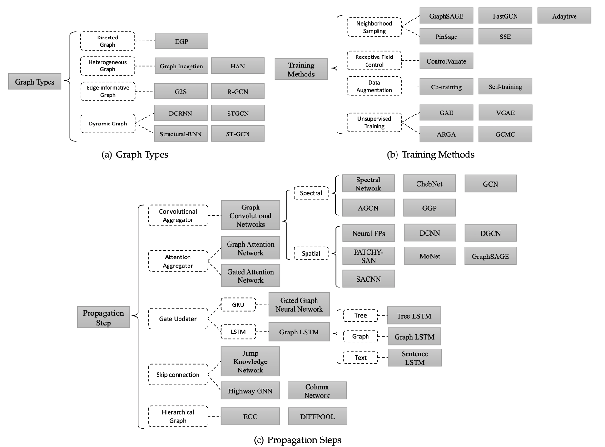

图网络
======

斯坦福CS224W:Machine Learning with Graphs
-----------------------------------------

斯坦福大学公开课，前身是Analysis of
Networks，2019年课改，所以课程中留有不少传统网络的东西。教授发音清晰（俄国口音真的很清晰，音节和音节之间分得明明白白）。\
课程网站：<http://web.stanford.edu/class/cs224w/>\
官方笔记：<https://snap-stanford.github.io/cs224w-notes/>\
深度学习相关部分用加粗标出。

| 序号  | 名称                                                      | 内容                                 |   
|------|-----------------------------------------------------------|-------------------------------------|
| 1    | Introduction Structure of Graphs                          | 图的基本概念：度、表示方法、连通度.  |   
| 2    | Measuring Networks and Random Graphs                      | 图的统计量：度分布、路径长度、聚类系数、连通度.        |   |   |
| 3    | Snap.py and Google Cloud Tutorial                         | 介绍斯坦福大学的图分析框架snap.py（类似networkx的工具）以及谷歌云的使用教程.      |
| 4    | Motifs and Structral Roles in Network                     | 图的局部结构.      |
| 5    | Community Structure in Networks                           | 社区发现算法.    |
| 6    | Review of Linear Algebra Probability and Proof techniques | 顾名思义，可以跳过.       |
| 7    | Spectral Clustering                                       | 谱聚类！                               |
| 8    | Message Passing and Node classification                   | 传统的节点分类方法，主要关注BP（信念传播）算法.   |
| 9    | Graph Representation Learning                             | 图嵌入方法：Shallow, DeepWalk, TransE, node2vec.          |
| 10   | Graph Neural Networks                                     | GNN终于来了：GCN, GraphSage, GAT.    |
| 11   | Graph Neural Networks Hands-on Session                    | 动手实践，使用Pytorch的图学习框架Pytorch_geometric.  |
| 12   | Deep Generative Models for Graphs                         | GraphRNN：用RNN做图生成（教授自己团队的成果），另外末尾还有一个非常有意思的东西：有目标导向的图生成（用于生成药物），结合了强化学习和对抗训练，同样是教授自己团队的成果. |   |   |
| 13   | Link Analysis PageRank                                    | 大名鼎鼎的PageRank算法.        |
| 14   | Networks Effects and Cascading Behavior                   | 图的传播效应和级联行为，该节主要是基于博弈论的方法（如疾病传播、假新闻传播、故障传播）.  |   |   |
| 15   | Probabilistic Contagion and Models of Influence           | 图传播的动力学模型：概率传染模型（传染病模型、谣言传播模型）  |
| 16   | Influence Maximization in Networks                        | 影响最大化：线性阈值模型和独立级联模型    |
| 17   | Outbreak Detection in Networks                            | 爆发点检测：爬山算法和CELF算法    |
| 18   | Network Evolution                                         | 动态网络：图统计量的变化、森林火灾模型、时序网络（时序PageRank） |
| 19   | Reasoning over Knowledge Graphs                           | 向量空间中知识图谱推理（Query2box）  |
| 20   | Limitations on Graph Neural Networks                      | 讲了GNN的2个缺陷：1. 对于不同结构的图可能会产生相同的结果（即不是单射），由此提出了GIN；2. 和其他DNN一样，GNN也会被对抗攻击. 另外提出了GNN一些未来的工作.    | 
| 21   | Applications of Graph Neural Networks                     | 讲了GNN的三个应用：主要篇幅在讲用于推荐系统的PinSage，另外还有用于异质网络的Decagon，以及第12节讲过的药物生成GCPN.        |

其他课程和tutorial
------------------

1.  宾夕法尼亚大学，ESE680: Graph Neural Networks\
    宾大的新课程，仍在更新当中。相较斯坦福大学的课程更为machine
    learning一些。老师长得像小罗伯特·唐尼。\
    课程网站：<https://gnn.seas.upenn.edu/>

2.  NLPCC Tutorial\
    NLPCC2020的图神经网络教程，内容很新，并且与其他AI领域（CV、NLP）联系紧密。\
    slides地址：<http://tcci.ccf.org.cn/conference/2020/dldoc/tutorial_3.pdf>

一些综述
--------

1.  [Deep Learning on Graphs: A
    Survey](https://arxiv.org/pdf/1812.04202.pdf)

2.  [Graph Neural Networks: A Review of Methods and
    Applications](https://arxiv.org/pdf/1812.08434.pdf)

3.  [A Comprehensive Survey on Graph Neural
    Networks](https://ieeexplore.ieee.org/abstract/document/9046288)

图网络知识脉络
--------------

<figure>
  
  <figcaption style="display: block; text-align: center;">图网络知识脉络图</figcaption>
</figure>

必读论文
--------

-   Ng, A. Y., Jordan, M. I., & Weiss, Y. (2002). On spectral
    clustering: Analysis and an algorithm. In Advances in neural
    information processing systems (pp. 849-856).\
    吴恩达老师引用量第二的文章，谱聚类的代表作。

-   Shuman, D. I., Narang, S. K., Frossard, P., Ortega, A., &
    Vandergheynst, P. (2013). The emerging field of signal processing on
    graphs: Extending high-dimensional data analysis to networks and
    other irregular domains. IEEE signal processing magazine, 30(3),
    83-98.\
    图信号处理的基本方法，算是基础。

-   Defferrard, M., Bresson, X., & Vandergheynst, P. (2016).
    Convolutional neural networks on graphs with fast localized spectral
    filtering. In Advances in neural information processing systems (pp.
    3844-3852).\
    ChebNet，图网络中频域卷积的代表作。

-   Kipf, T. N., & Welling, M. (2016). Semi-supervised classification
    with graph convolutional networks. arXiv preprint arXiv:1609.02907.\
    GCN的原始论文，对ChebNet做了简化和修改。

-   Hamilton, W., Ying, Z., & Leskovec, J. (2017). Inductive
    representation learning on large graphs. In Advances in neural
    information processing systems (pp. 1024-1034).\
    GraphSage，针对GCN只能处理固定图的缺陷，提出了一种归纳（inductive）学习的方法，使模型可以处理没有见过的节点。

-   Veličković, P., Cucurull, G., Casanova, A., Romero, A., Lio, P., &
    Bengio, Y. (2017). Graph attention networks. arXiv preprint
    arXiv:1710.10903.\
    GAT，图上的注意力机制。

-   Chami, I., Ying, Z., Ré, C., & Leskovec, J. (2019). Hyperbolic graph
    convolutional neural networks. In Advances in neural information
    processing systems (pp. 4868-4879).\
    在双曲空间中做图嵌入。