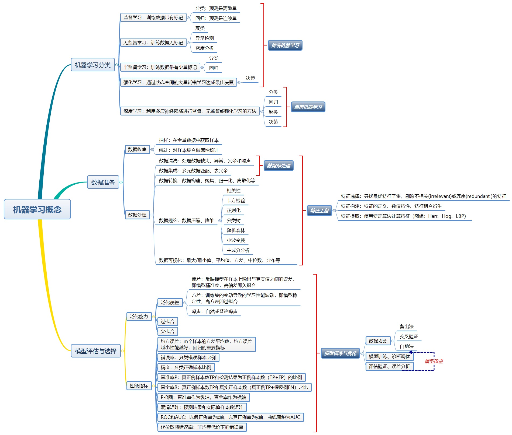
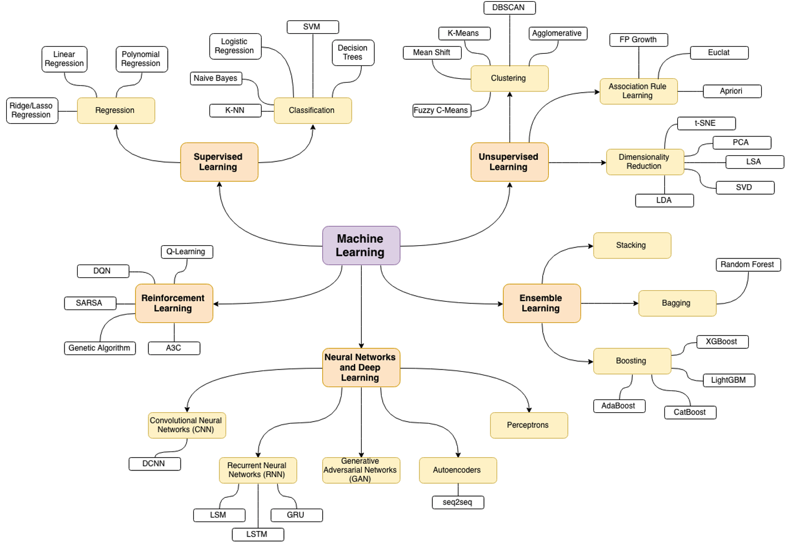
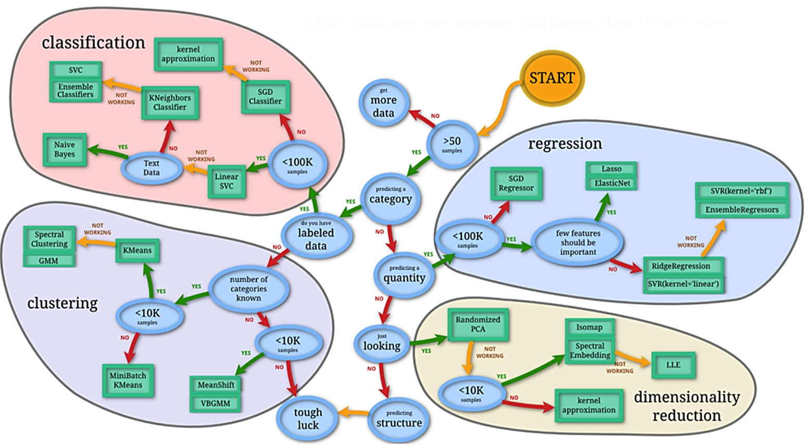

机器学习
========

  * [知识脉络图](##知识脉络图)
  * [学习资料](##学习资料)
  * [相关论文](##相关论文)

知识脉络图
----------

<figure>
  
  <figcaption style="display: block; text-align: center;">机器学习总知识脉络（<a href="https://www.cnblogs.com/wnwin/p/9684520.html">原图</a>）</figcaption>
</figure>

针对机器学习分类中各个类别所常用的模型如下图所示：
<figure>
  
  <figcaption style="display: block; text-align: center;">各个类别常用模型（<a href="https://github.com/trekhleb/machine-learning-octave">原图</a>）</figcaption>
</figure>

而如何分析问题并且选择模型具体如下图所示:
<figure>
  
  <figcaption style="display: block; text-align: center;">各类别模型选择（<a href="https://scikit-learn.org/stable/tutorial/machine_learning_map/index.html">原图</a>）</figcaption>
</figure>

最后推荐<https://whimsical.com/CA7f3ykvXpnJ9Az32vYXva>，里面对于机器学习脉络有着非常详细的叙述

学习资料
--------

#### 书籍

-   入门：周志华的《机器学习》

-   公式和原理：李航的《统计学习方法》

-   实战：《机器学习实战》，作者是 Peter
    Harrington；《Python机器学习及实践 从零开始通往Kaggle竞赛之路

#### 网站

-   机器学习简介：<https://blog.csdn.net/hohaizx/article/details/80584307>

-   机器学习十大算法：<https://blog.csdn.net/qq_42379006/article/details/80741808>

-   英文版的入门介绍，可以当课外阅读看：<https://machinelearningmastery.com/machine-learning-roadmap-your-self-study-guide-to-machine-learning/>

-   人工智能、机器学习和深度学习的区别：<https://www.zhihu.com/question/57770020>

#### 学习课程和ppt

-   基础版：[http://www.cs.cmu.edu/ tom/10701_sp11/lectures.shtml](http://www.cs.cmu.edu/~tom/10701_sp11/lectures.shtml) 
    课程内容：Decision Trees；Probability and Estimation；Naive
    Bayes；Logistic Regression；Linear Regression；Practical Issues:
    Feature selection etc.

-   进阶版：<http://work.caltech.edu/lectures.html> 
    课程内容：Theory of Generalization；The VC Dimension；Bias-Variance
    Tradeoff；The Linear Model II；Neural
    Networks；Overfitting；Regularization；Validation etc.

-   吴恩达机器学习： 
    <https://www.bilibili.com/video/BV164411b7dx>

-   李宏毅机器学习： 
    <https://www.bilibili.com/video/BV1JE411g7XF>

相关论文
--------

-   线性回归：[Linear Regression Analysis: Theory and Computing by Xin
    Yan, Xiao Gang
    Su](https://www.researchgate.net/publication/227373853_Linear_Regression_Analysis_Theory_and_Computing_by_Xin_Yan_Xiao_Gang_Su)

-   逻辑斯蒂回归：[Applied logistic
    regression](https://www.wiley.com/en-us/Applied+Logistic+Regression%2C+3rd+Edition-p-9780470582473)

-   VC维：[Learnability and the Vapnik–Chervonenkis
    dimension](https://dl.acm.org/doi/10.1145/76359.76371)

-   支持向量机(SVM)： 
    - [A training algorithm for optimal margin
    classifiers](https://dl.acm.org/doi/10.1145/130385.130401) 
    - [Support vector
    networks](https://dl.acm.org/doi/10.1023/A%3A1022627411411) 
    - [Extracting support data for a given
    task](https://www.aaai.org/Papers/KDD/1995/KDD95-030.pdf) 
    - [Advances in Kernel
    Methods](https://dl.acm.org/doi/10.1023/A%3A1022627411411)

-   K近邻算法(KNN)：[An Introduction to Kernel and Nearest-Neighbor
    Nonparametric
    Regression](https://citeseerx.ist.psu.edu/viewdoc/download?doi=10.1.1.1010.2854&rep=rep1&type=pdf)

-   决策树与随机森林： 
    - [Classification and Regression
    Trees](https://onlinelibrary.wiley.com/doi/abs/10.1002/cyto.990080516) 
    - [Induction of decision
    trees](https://dl.acm.org/doi/10.1023/A%3A1022643204877) 
    - [Random
    Forests](https://link.springer.com/article/10.1023/A:1010933404324)

-   Boosting： 
    - [Boosting a weak learning algorithm by
    majority](https://cseweb.ucsd.edu/~yfreund/papers/BoostByMajority.pdf) 
    - [A decision-theoretic generalization of on-line learning and an
    application to
    boosting.](https://www.face-rec.org/algorithms/Boosting-Ensemble/decision-theoretic_generalization.pdf) 
    - [An adaptive version of the boost by majority
    algorithm](https://cseweb.ucsd.edu/~yfreund/papers/brownboost.pdf) 
    - [LightGBM: A Highly Efficient Gradient Boosting Decision
    Tree.](https://papers.nips.cc/paper/2017/file/6449f44a102fde848669bdd9eb6b76fa-Paper.pdf)

-   主成分分析(PCA)：[Kernel PCA and de-noising in feature
    spaces](https://alex.smola.org/papers/1999/MikSchSmoMuletal99.pdf)

-   K-means：[A K-Means Clustering
    Algorithm](https://www.jstor.org/stable/2346830?seq=1)

-   神经网络： 
    - [The Perceptron: A Model for Brain
    Functioning](https://static1.squarespace.com/static/5b58c02775f9ee8fa7e52f00/t/5eff679acdfa560968e5f7f2/1593796507323/block_62.pdf) 
    - [Learning representations by back-propagating
    errors](https://www.nature.com/articles/323533a0) 
    - [Gradient-based learning applied to document
    recognition](http://vision.stanford.edu/cs598_spring07/papers/Lecun98.pdf) 
    - [Backpropagation through time: what it does and how to do
    it](https://ieeexplore.ieee.org/document/58337)

-   优化理论： 
    - [On the momentum term in gradient descent learning
    algorithms](https://citeseerx.ist.psu.edu/viewdoc/download?doi=10.1.1.57.5612&rep=rep1&type=pdf) 
    - [Stochastic Gradient Descent
    Tricks.](https://www.microsoft.com/en-us/research/publication/stochastic-gradient-tricks/) 
    - [Adam: a method for stochastic
    optimization](https://arxiv.org/abs/1412.6980)