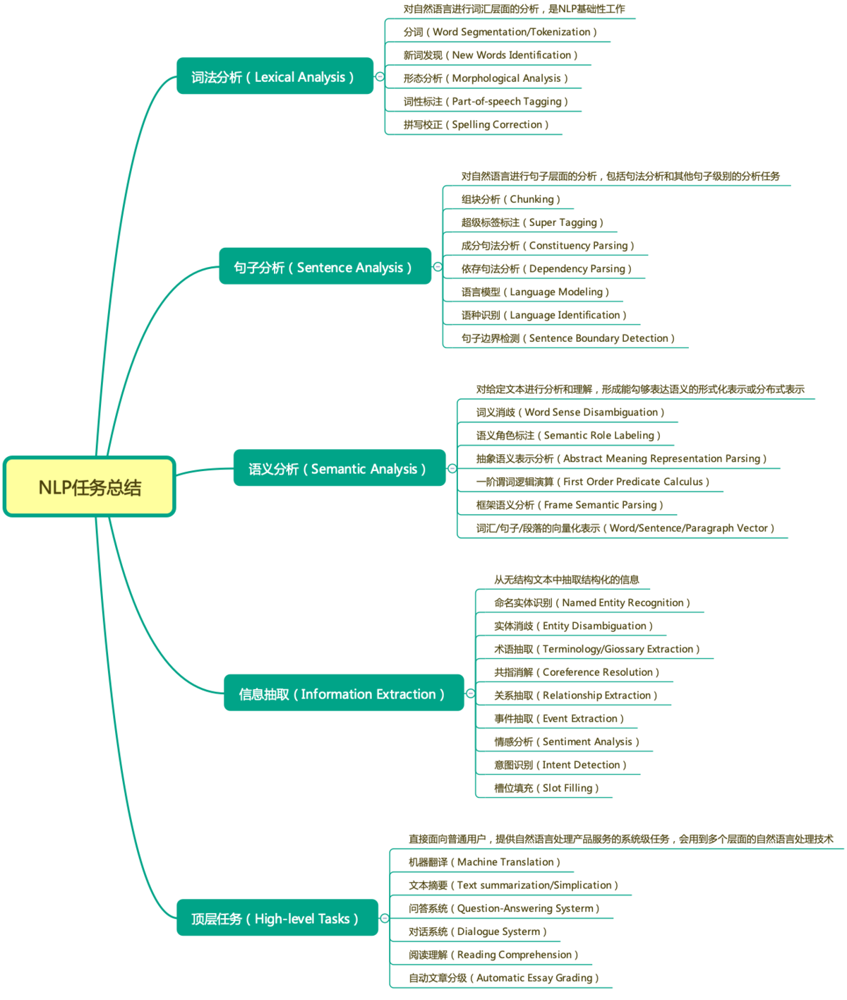
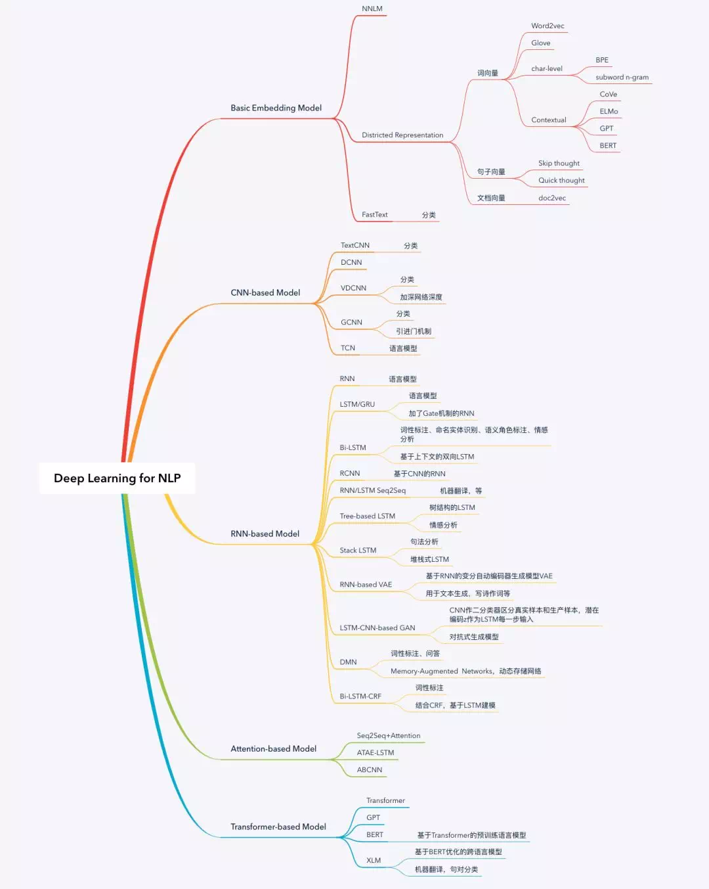
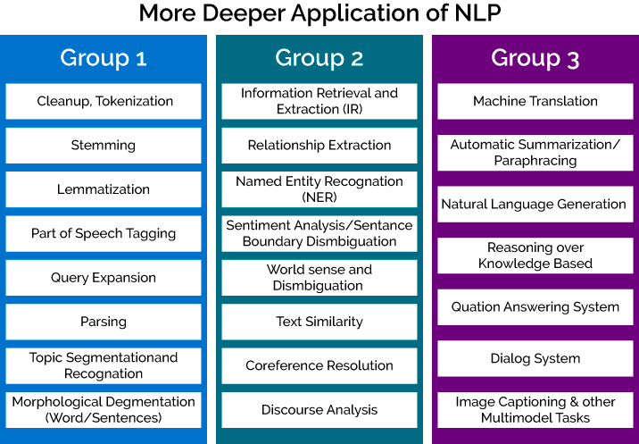
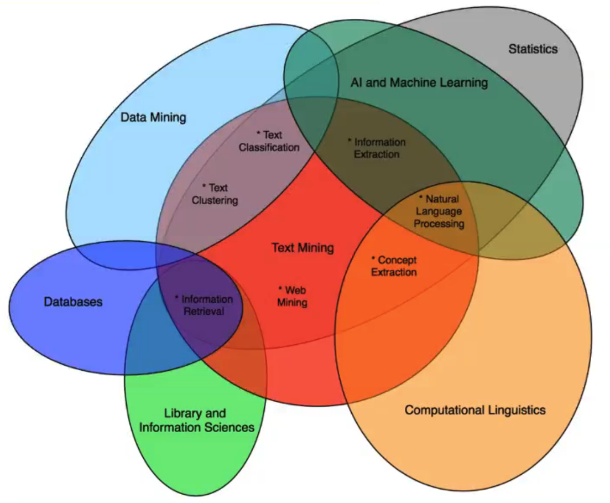

自然语言处理
============

  * [知识脉络图](##知识脉络图)
  * [经典论文](##经典论文)
  * [公开课](##公开课)
  * [书籍](##书籍)
  * [其他资料](##其他资料)
  * [国际顶级会议](##国际顶级会议)

知识脉络图
----------

<figure>
  
  <figcaption style="display: block; text-align: center;">自然语言处理任务分类以及子领域（<a href="https://www.jianshu.com/p/d80b065bdcf0">原图</a>）</figcaption>
</figure>

<figure>
  
  <figcaption style="display: block; text-align: center;">自然语言处理知识脉络图（<a href="https://www.jiqizhixin.com/articles/2019-06-21">原图</a>）</figcaption>
</figure>

<figure>
  
  <figcaption style="display: block; text-align: center;">Group1到Group3：底层/基础任务到顶层/具体应用（<a href="https://www.packtpub.com/product/python-natural-language-processing/9781787121423">原图</a>）</figcaption>
</figure>

<figure>
  
  <figcaption style="display: block; text-align: center;">自然语言处理任务子领域之间的交叉关系（<a href="https://bbds.ma/wp-content/uploads/2017/11/BBDS-Deep-Learning-NLP-Text-Mining-2.pdf">原图</a>）</figcaption>
</figure>

经典论文
--------

1.  Seq2Seq + Attention\
    论文：<https://papers.nips.cc/paper/5346-sequence-to-sequence-learning-with-neural-networks.pdf>\
    实现：<https://github.com/google/seq2seq>\
    贡献：Seq2Seq模型与注意力机制的结合。

2.  Transformer\
    论文：<https://arxiv.org/pdf/1706.03762.pdf>\
    tf实现：<https://github.com/Kyubyong/transformer>\
    pytorch实现：<https://github.com/jadore801120/attention-is-all-you-need-pytorch>\
    贡献：用全attention的结构代替了lstm，在翻译任务上取得了更好的成绩。Transformer改进了RNN最被人诟病的训练慢的缺点，利用self-attention机制实现快速并行。并且Transformer可以增加到非常深的深度。

3.  ELMo\
    论文：<https://arxiv.org/pdf/1802.05365.pdf>\
    贡献：根据当前上下文对Word Embedding动态调整，而非过去的静态词嵌入。

4.  BERT\
    论文：<https://arxiv.org/abs/1810.04805>\
    tensorflow实现：<https://github.com/google-research/bert>\
    pytorch实现：<https://github.com/huggingface/transformers>\
    贡献：1)使用了Transformer作为算法的主要框架，Transformer能更彻底的捕捉语句中的双向关系；\
    2)使用了Mask Language Model(MLM)和 Next Sentence Prediction(NSP)
    的多任务训练目标；\
    3)使用更强大的机器训练更大规模的数据，使BERT的结果达到了全新的高度，并且Google开源了BERT模型，用户可以直接使用BERT作为Word2Vec的转换矩阵并高效的将其应用到自己的任务中。

5.  XLM\
    论文：<https://arxiv.org/abs/1901.07291>\
    实现：<https://github.com/facebookresearch/XLM>\
    贡献：1、提出了一种新的无监督方法。使用跨语言语言建模来学习跨语言表示，并研究了两种单语预训练的目标函数。\
    2、提出一个新的监督学习目标。当有平行语料时，该目标可以改进跨语言的预训练。\
    3、本文的模型在跨语言分类、无监督机器翻译和有监督机器翻译方面都显著优于以往的最优结果。\
    4、本文实验表明跨语言模型对于low-resource语种数据集，也能够显著改善其他语种的困惑度(perplexity)。

6.  XLNet\
    论文：<https://arxiv.org/abs/1906.08237>\
    实现：[
    https://github.com/zihangdai/xlnet]( https://github.com/zihangdai/xlnet)\
    贡献：1） 与Bert采取De-noising
    Autoencoder方式不同的新的预训练目标：Permutation Language
    Model(简称PLM)；这个可以理解为在自回归LM模式下，如何采取具体手段，来融入双向语言模型。这个是XLNet在模型角度比较大的贡献，确实也打开了NLP中两阶段模式潮流的一个新思路。\
    2）
    引入了Transformer-XL的主要思路：相对位置编码以及分段RNN机制。实践已经证明这两点对于长文档任务是很有帮助的；\
    3）
    加大增加了预训练阶段使用的数据规模；Bert使用的预训练数据是BooksCorpus和英文Wiki数据，大小13G。XLNet除了使用这些数据外，另外引入了Giga5，ClueWeb以及Common
    Crawl数据，并排掉了其中的一些低质量数据，大小分别是16G,19G和78G。可以看出，在预训练阶段极大扩充了数据规模，并对质量进行了筛选过滤。这个明显走的是GPT2.0的路线。

7.  ERNIE\
    论文：<https://arxiv.org/pdf/1905.07129.pdf>\
    实现：<https://github.com/thunlp/ERNIE>\
    贡献：将知识图谱的信息加入到BERT模型的训练中，这样模型就可以从大规模的文本语料和先验知识丰富的知识图谱中学习到字、词、句以及知识表示等内容，让BERT掌握更多的人类先验知识。

8.  NNLM：<https://jmlr.org/papers/volume3/bengio03a/bengio03a.pdf>

9.  CNN在NLP：<https://arxiv.org/abs/1408.5882>

公开课
------

1.  汤斯亮-自然语言处理\
    内网访问：<https://10.214.143.253/>

2.  CS224n\
    主页：<http://web.stanford.edu/class/cs224n/index.html>\
    B站链接：<https://www.bilibili.com/video/av46216519/>\
    介绍：斯坦福相当不错的NLP入门课程，包括词嵌入、依存关系解析、神经机器翻译、语音识别、Transformer
    、预训练表征和语义消歧等。课程笔记、PPT
    资料以及作业都可以在主页上获取。

3.  CS 11-747 主页：<http://phontron.com/class/nn4nlp2019/>\
    B站链接：<https://www.bilibili.com/video/av40929856/>\
    介绍：伯克利的，包括建模不同长度和结构的句子、处理大型自然语言数据、半监督和无监督学习、结构化预测和多语言建模、ELMo/BERT
    上下文词表示、模型可解释性等等。

书籍
----

-   《Python自然语言处理》（python
    NLTK库配套）:极好的NLP入门图书，涉及到自然语言处理的方方面面，包括分词、词典、词性标注、NER、语法分析、文本分类、语料库等等。缺点：未涉及中文语言处理。

-   《自然语言处理入门》:HanLP作者
    何晗，一个从零开始学NLP的大佬的历程与经验。

-   《NLP汉语自然语言处理》:从语言学讲到自然语言处理，比较全面。

其他资料
--------

1.  HanLP\
    链接：<https://github.com/hankcs/HanLP>\
    介绍：基于 TensorFlow 2.x中文分词 词性标注 命名实体识别 依存句法分析
    语义依存分析 新词发现 关键词短语提取 自动摘要 文本分类聚类
    拼音简繁转换 自然语言处理等。

2.  NLP tutorial\
    链接：<https://github.com/graykode/nlp-tutorial>\
    介绍：NLP的pytorch小教程，其实似乎没啥用。

3.  thunlp\
    链接：<https://github.com/thunlp/>\
    介绍：清华的NLP项目组开源。

4.  中文BERT预训练模型\
    链接：<https://github.com/ymcui/Chinese-BERT-wwm>\
    介绍：哈工大的中文NLP预训练模型。

5.  huggingface transformer\
    链接：<https://huggingface.co/transformers/index.html>\
    介绍：非常全的NLP预训练模型代码库。huggingface还有一个model
    zoo，上面有非常多的可供使用的预训练模型。

6.  <https://github.com/fastnlp/fastNLP>

7.  <https://github.com/FudanNLP/nlp-beginner>

国际顶级会议
------------

-   ACL - Meeting of the Association for Computational Linguistics

-   EMNLP - Conference on Empirical Methods in Natural Language
    Processing

-   NAACL – Conference of the North American Chapter of the Association
    for Computational Linguistics